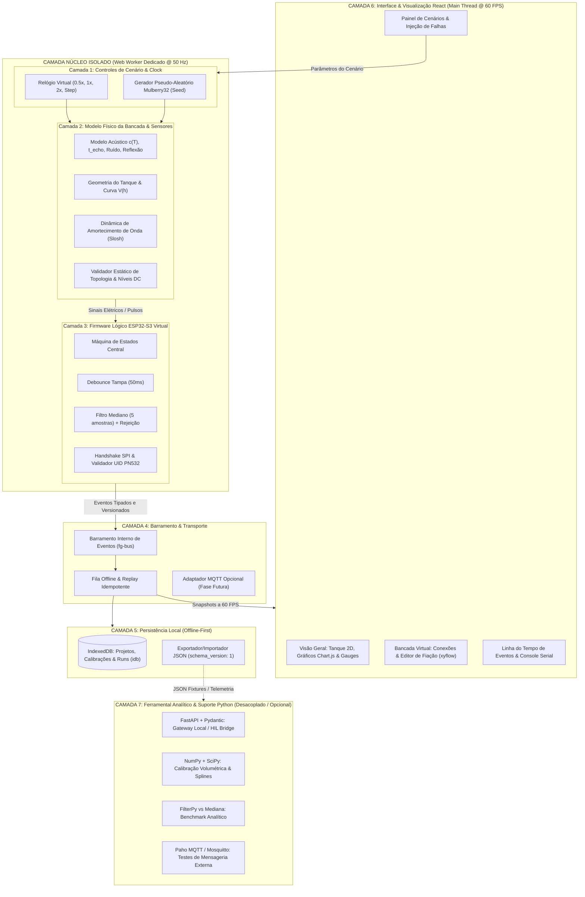

# FuelGuard Virtual Test Bench — Especificação Arquitetural e Modelagem Técnica

> **Documento:** ARCHITECTURE.md  
> **Versão:** 1.1.0  
> **Status:** Proposta de Engenharia para Revisão  
> **Referência:** Brief de Produto e Simulação FuelGuard (Seções 3 a 8) & Diretrizes de Alta Performance e Fluidez

---

## 1. Visão Geral da Arquitetura em Camadas

A arquitetura do **FuelGuard Virtual Test Bench** é concebida com separação estrita de responsabilidades inspirada no padrão Ports & Adapters (Hexagonal). O princípio cardeal de engenharia adotado é: **o motor físico-matemático e o firmware lógico rodam de forma 100% autônoma, desacoplados da interface visual e da biblioteca gráfica**, garantindo que a aplicação seja **leve, fluida e totalmente livre de travamentos (*zero UI jank*)**.



---

## 2. Estratégia de Alta Performance e Fluidez (Anti-Jank)

Para atender ao requisito estrito de ser **um projeto leve, responsivo e sem travamentos**, a arquitetura implementa três mecanismos fundamentais:

1. **Isolamento em Web Worker:**
   - Todo o loop temporal da simulação ($\Delta t = 20\text{ ms}$, equivalente a 50 Hz), o gerador de números aleatórios com semente, o cálculo da propagação sonora $c(T)$, a geometria volumétrica e os filtros digitais rodam em uma thread de sistema em segundo plano (*Web Worker*).
   - A thread principal do navegador (onde o React renderiza componentes e o usuário interage) permanece 100% desobstruída para eventos de mouse, arrastar de conexões no canvas e animações CSS.
2. **Bufferização e Envio Decapitado (*Throttled Snapshot Batching*):**
   - Em vez de enviar cada leitura de pulso ultrassônico individualmente para a UI via `postMessage` (o que causaria sobrecarga de serialização e saturação de mensagens), o Web Worker agrupa os dados e despacha snapshots consolidados no ritmo de atualização da tela (30 a 60 Hz).
   - Eventos de mudança de estado (`lid.changed`, `session.started`, `sensor.fault`) são emitidos imediatamente com prioridade alta.
3. **Canvas 2D Baseado em SVG Vetorial Leve:**
   - No MVP, o canvas de bancada utiliza `@xyflow/react` com nós desenhados em SVG puro estilizados via Tailwind. Isso consome uma fração mínima de memória RAM se comparado a motores de física 3D em WebAssembly (como Rapier) ou instâncias pesadas de Three.js.
   - O corte do tanque didático é desenhado em HTML5 Canvas 2D nativo com interpolação suave de superfície d'água via equação harmônica amortecida, garantindo 60 FPS estáveis mesmo em laptops ou computadores escolares com gráficos integrados.
4. **Decimação de Dados nos Gráficos:**
   - O Chart.js é configurado com decimação automática (*LTTB - Largest-Triangle-Three-Buckets*), mantendo no máximo 200 pontos visíveis no viewport do gráfico, evitando vazamento de memória ou perda de fluidez após horas de simulação contínua.

---

## 3. Detalhamento das Camadas Arquiteturais

### Camada 1: Controles do Cenário e Relógio Virtual
- **Responsabilidade:** Receber parâmetros validados do usuário (dimensões do tanque, temperatura ambiente $T$, volume inicial, presença e UID da tag NFC, estado da tampa, ruído acústico, perturbações na rede).
- **Relógio Virtual (`SimulationClock`):** Implementa um loop discreto com passo temporal fixo ($\Delta t = 20\text{ ms}$). Permite pausar, avançar passo-a-passo (*single step*) e acelerar a simulação ($0.5\times$, $1\times$, $2\times$).
- **Determinismo Estrito (`PRNG`):** Utiliza gerador pseudo-aleatório com semente configurável (*seeded pseudo-random number generator*, algoritmo Mulberry32). O mesmo cenário rodado com a mesma semente produzirá exatamente os mesmos ruídos acústicos e tempos de eco, viabilizando testes reproduzíveis.

### Camada 2: Modelo Físico da Bancada e Acústica do Tanque
- **Responsabilidade:** Traduzir o estado dinâmico da água em grandezas físicas mensuráveis pelo sensor JSN-SR04T v2.0.
- **Modelagem Acústica:**
  1. *Velocidade do som no ar seco em função da temperatura:*
     $$c(T) = 331.3 \cdot \sqrt{1 + \frac{T}{273.15}} \quad [\text{m/s}]$$
     *(Para $T = 20^\circ\text{C}$, $c \approx 343.21\text{ m/s}$; para $T = 30^\circ\text{C}$, $c \approx 349.02\text{ m/s}$)*.
  2. *Tempo de trânsito ultrassônico de ida e volta ($t_{echo}$):*
     $$t_{echo} = \frac{2 \cdot d_{real}}{c(T)} \quad [\text{segundos}]$$
  3. *Zona Cega do Sensor:* O JSN-SR04T v2.0 possui zona cega física de aproximadamente $20\text{ cm}$ a $25\text{ cm}$. Se a distância $d < 20\text{ cm}$, a reflexão atinge o transdutor durante o anelamento piezoelétrico (*ringing*), produzindo leitura instável ou saturação mínima.
  4. *Alcance Máximo e Timeout:* Se $d > 450\text{ cm}$ ou se o feixe for disperso por ângulo oblíquo ou agitação extrema, nenhum eco retorna dentro da janela de $30\text{ ms}$, disparando timeout do sensor.
  5. *Injeção de Ruído:*
     $$d_{medida} = d_{real} + \mathcal{N}(0, \sigma_{ruido}^2) + \text{perturbacao\_slosh}$$

- **Modelagem Geométrica do Recipiente:**
  1. *Altura da coluna d'água:*
     $$h = H_{ref} - d$$
     Onde $H_{ref}$ é a distância entre a face emissora do transdutor fixo e o fundo do recipiente (medida na bancada física).
  2. *Cálculo do Volume:*
     - Para tanque prismático retangular de base $L \times W$:
       $$V(h) = L \cdot W \cdot h$$
     - Para galão cilíndrico/irregular: Interpolação monotônica por spline linear ou PCHIP a partir da tabela empírica de calibração $[h_i, V_i]$ gerada por ensaio de bancada com proveta graduada.

- **Modelo de Agitação e Oscilação da Água (Slosh Amortecido):**
  Representação didática por oscilador harmônico amortecido:
  $$\Delta h_{slosh}(t) = A_0 \cdot e^{-\zeta \omega_n t} \cdot \cos(\omega_d t)$$
  *Nota Pedagógica:* O sistema rotula explicitamente esse modelo como "oscilação harmônica aproximada", frisando que **não** se trata de CFD nem de dinâmica de fluidos multifásica.

### Camada 3: Firmware Lógico do ESP32-S3 Virtual
- **Responsabilidade:** Executar com fidelidade o algoritmo que estará presente no sketch C++ real do microcontrolador.
- **Filtro de Amostragem do Nível:**
  - Janela deslizante (*circular buffer*) de 5 leituras consecutivas.
  - Ordenação e extração da mediana para eliminar ruídos impulsivos (saltos abruptos causados por bolhas ou reflexão parasita).
  - Cálculo do desvio padrão na janela: se $\sigma > \text{limiar}$, emite qualidade `unstable`; se todas as leituras estiverem dentro da tolerância, emite `valid`.
  - Histerese temporal para transição de patamar volumétrico.
- **Debounce do Sensor de Tampa (Reed Switch):**
  - Entrada física no GPIO7 com resistor pull-up.
  - Ao detectar borda de transição, inicia timer de $50\text{ ms}$. Somente se o nível lógico permanecer estável após a janela é gerado o evento `lid.changed`. Rebotes transitórios (*contact bounce*) são visíveis apenas no monitor de sinal bruto.
- **Máquina de Estados de Leitura NFC (PN532):**
  - Protocolo SPI em $3,3\text{ V}$.
  - Estados: `IDLE` $\rightarrow$ `SCANNING` $\rightarrow$ `CARD_DETECTED` $\rightarrow$ `VALIDATING_UID` $\rightarrow$ `SESSION_ACTIVE` ou `ACCESS_DENIED`.
  - Tags de teste pré-configuradas (Operador Autorizado `04:3A:7F:2C:5D`, Operador Negado `04:9B:11:3E:8A`).
  - Avisos no dashboard: O UID é meramente didático para abrir sessão; o sistema esclarece que UID pode ser clonado facilmente e não é credencial segura de produção.

### Camada 4: Barramento de Eventos e Transporte
- **Responsabilidade:** Distribuição assíncrona desacoplada de telemetria entre o motor de simulação e os consumidores de interface.
- **Barramento Interno (`fg-bus`):** Sistema Pub/Sub tipado em TypeScript com ordenação estrita baseada em `sim_time_ms` + `seq`.
- **Fila Offline com Garantia de Idempotência:**
  - Se o usuário acionar o toggle "Wi-Fi Desconectado / Offline", os eventos deixam de ser despachados para a tela imediatamente e acumulam-se em um buffer persistente (`offline_queue`).
  - Ao reconectar a rede, a fila é descarregada em lote em ordem cronológica estrita, atualizando as séries temporais sem perda de dados ou duplicação de pacotes.

### Camada 5: Persistência Local (IndexedDB & Schema JSON)
- **Responsabilidade:** Garantir que o usuário possa fechar o navegador, recarregar a página e retomar seu projeto e histórico de ensaios exatamente de onde parou, sem exigir contas em nuvem ou servidor externo.
- **IndexedDB (`bancada_fuelguard_db`):**
  - Store `projects`: Parâmetros do tanque, geometrias e pinagens salvas.
  - Store `calibrations`: Tabelas empíricas de calibração $[d, h, V]$.
  - Store `scenarios`: Presets configurados de ensaio.
  - Store `telemetry_logs`: Histórico de eventos de execuções anteriores.
- **Contrato de Exportação/Importação:** Arquivos no formato `.json` validados por schema tipado (`schema_version: 1`).

### Camada 6: Central de Comando & Visualização (UI React)
- **Responsabilidade:** Fornecer ao operador uma experiência interativa, de altíssima densidade informativa, elegante e tecnicamente honesta.
- Interface escura de inspiração industrial e automotiva com tema didático.
- Renderização visual 2D acessível, rápida e sem travamentos.

### Camada 7: Ferramental Analítico & Suporte Python (Desacoplado)
- **Responsabilidade:** Apoiar análises quantitativas, calibrações de bancada física, benchmarks comparativos e eventual bridge de hardware real, sem onerar o cliente web.
- **FastAPI / Pydantic:** Servidor de suporte local para telemetria ou interface HIL via porta serial/USB, caso o usuário deseje conectar um ESP32 físico diretamente ao ecossistema.
- **FilterPy vs Mediana:** Script de benchmark provando estatisticamente a adequação do filtro mediano frente ao filtro de Kalman em ruídos impulsivos de ultrassom.
- **NumPy / SciPy:** Scripts de pré-processamento de curvas de calibração empírica $V(h)$ para galões plásticos com geometria irregular.

---

## 4. Modelo Elétrico da Bancada e Regras de Validação

A bancada virtual implementa um modelo elétrico didático formal com pinagens exatas e regras de validação estática de conexões:

### 4.1. Mapa de Pinos e Tensões Oficiais da Bancada

```text
ESP32-S3 DevKitC-1 (3.3V Logic)
┌────────────────────────────────────────────────────────┐
│ GPIO4  ──────> [1 kΩ] ───> [LED Verde] ───> GND        │
│ GPIO5  ──────> SN74AHCT125N A1 (pino 2)                │
│ GPIO6  <────── Nó Divisor (10 kΩ / 15 kΩ)              │
│ GPIO7  <────── [10 kΩ Pull-up a 3V3] + [Reed Switch]   │
│ GPIO10 ──────> PN532 CS (SPI)                          │
│ GPIO11 ──────> PN532 MOSI (SPI)                        │
│ GPIO12 ──────> PN532 SCK (SPI)                         │
│ GPIO13 <────── PN532 MISO (SPI)                        │
│ 5V_EXT ──────> JSN-SR04T VCC + SN74AHCT125N VCC (p14)  │
│ 3V3    ──────> PN532 VCC + Pull-ups                    │
│ GND    ═══════ Barramento Comum Unificado              │
└────────────────────────────────────────────────────────┘

Condicionamento de Nível para JSN-SR04T v2.0 (Alimentado a 5V):
1. Sinal TRIG (ESP32 -> Sensor):
   - ESP32 GPIO5 (3,3 V) -> SN74AHCT125N Entrada A1 (pino 2).
   - Buffer alimentado a 5 V (p14) com /OE1 (pino 1) aterrado em GND.
   - Saída Y1 (pino 3) entrega pulso de 5 V CMOS para o pino TRIG do JSN.
   - Pinos não utilizados (/OE2, /OE3, /OE4) em 5 V; entradas em GND.

2. Sinal ECHO (Sensor -> ESP32):
   - Pino ECHO do JSN entrega pulso de 5 V.
   - Conectado a resistor de 10 kΩ em série.
   - Nó intermediário conectado a resistor de 15 kΩ para GND.
   - Tensão no nó intermediário conectado ao GPIO6:
     V_gpio = 5.0 V * (15 kΩ / (10 kΩ + 15 kΩ)) = 5.0 * (15 / 25) = 3.00 V.
   - Perfeitamente compatível com o patamar seguro do GPIO (0 a 3,3 V).
```

### 4.2. Regras de Validação Verificadas pelo Motor Elétrico

O validador elétrico examina em tempo real o grafo de conexões da bancada gerado no editor:

| ID Regra | Condição Detectada no Canvas | Severidade | Mensagem Didática Emitida |
| :--- | :--- | :--- | :--- |
| **RULE-ELEC-01** | Pino ECHO do JSN (5 V) conectado diretamente a qualquer GPIO do ESP32 sem divisor de tensão. | **CRÍTICO** | *"Sobretensão Detectada! O pino ECHO do JSN-SR04T opera em 5 V. Ligar diretamente ao GPIO do ESP32-S3 (máx 3,3 V) danificará permanentemente a porta do microcontrolador. Insira o divisor resistivo 10 kΩ / 15 kΩ."* |
| **RULE-ELEC-02** | Pino TRIG do JSN conectado diretamente ao GPIO do ESP32 sem o buffer SN74AHCT125N. | **AVISO** | *"Nível Lógico Marginal! O JSN-SR04T v2.0 alimentado a 5 V pode não reconhecer confiavelmente disparos com nível alto de 3,3 V. Utilize o buffer SN74AHCT125N para elevar o sinal a 5 V."* |
| **RULE-ELEC-03** | Módulo conectado sem ligação com o GND comum da bancada. | **CRÍTICO** | *"Terra Flutuante! Todos os módulos (ESP32, JSN, PN532, divisor e buffer) devem compartilhar o mesmo referencial de GND para que os sinais lógicos sejam interpretados corretamente."* |
| **RULE-ELEC-04** | LED conectado diretamente ao GPIO sem resistor limitador de corrente de 1 kΩ. | **CRÍTICO** | *"Sobrecorrente no LED! O diodo emissor de luz sem resistor em série causará curto no GPIO4 e queima do componente."* |
| **RULE-ELEC-05** | Curto-circuito entre linha de alimentação (5V ou 3V3) e terra (GND). | **BLOQUEANTE** | *"Curto-Circuito em Barra de Alimentação! Desarme imediato da fonte virtual."* |
| **RULE-ELEC-06** | Inversão dos sinais MOSI e MISO na interface SPI do PN532. | **ERRO** | *"Erro de Barramento SPI: MOSI (Master Out) do ESP32 deve conectar-se ao MOSI do PN532, e MISO ao MISO. Comunicação inoperante."* |

---

## 5. Contratos de Eventos e Modelo de Dados

### 5.1. Definições TypeScript (Núcleo Web)

```typescript
export interface BaseSimulationEvent<TKind extends string, TPayload> {
  schema_version: 1;
  event_id: string;          // Ex: "FG-VSIM-run-01-seq-42"
  device_id: string;         // Ex: "FG-VSIM-01"
  seq: number;               // Contador incremental estrito
  sim_time_ms: number;       // Timestamp do relógio virtual em ms
  kind: TKind;               // Identificador semântico do evento
  session_id: string | null; // ID da sessão de teste autorizada (ou null)
  payload: TPayload;
}

export type NfcSessionStartedEvent = BaseSimulationEvent<
  "session.started",
  {
    operator_ref: string;
    uid_masked: string;
    status: "authorized";
    auth_mode: "demonstrativo_didatico";
  }
>;

export type NfcDeniedEvent = BaseSimulationEvent<
  "nfc.denied",
  {
    uid_masked: string;
    reason: "unknown_tag" | "crc_error" | "card_removed_fast";
    status: "denied";
  }
>;

export type LidChangedEvent = BaseSimulationEvent<
  "lid.changed",
  {
    open: boolean;
    raw_bounce_count: number;
    quality: "clean_transition" | "debounced";
  }
>;

export type TankQuality = "valid" | "unstable" | "out_of_range" | "timeout";

export type TankSampleEvent = BaseSimulationEvent<
  "tank.sample",
  {
    distance_raw_cm: number;
    t_echo_us: number;
    temperature_c: number;
    quality: TankQuality;
  }
>;

export type TankStableEvent = BaseSimulationEvent<
  "tank.stable",
  {
    distance_cm: number;
    liquid_height_cm: number;
    volume_l: number;
    volume_percent: number;
    quality: TankQuality;
    calibration_id: string;
  }
>;

export type TransportStateEvent = BaseSimulationEvent<
  "transport.state",
  {
    online: boolean;
    pending_count: number;
    retry_attempt: number;
    rssi_dbm: number | null;
  }
>;

export type SensorFaultEvent = BaseSimulationEvent<
  "sensor.fault",
  {
    code: "ERR_ECHO_TIMEOUT" | "ERR_BLIND_ZONE" | "ERR_SPI_COMM" | "ERR_OVERVOLTAGE";
    message: string;
    recoverable: boolean;
    suggested_action: string;
  }
>;
```

### 5.2. Espelho de Contratos em Python (Pydantic v2)

```python
from enum import Enum
from typing import Generic, Literal, Optional, TypeVar
from pydantic import BaseModel, Field

TKind = TypeVar("TKind", bound=str)
TPayload = TypeVar("TPayload")

class TankQuality(str, Enum):
    VALID = "valid"
    UNSTABLE = "unstable"
    OUT_OF_RANGE = "out_of_range"
    TIMEOUT = "timeout"

class BaseSimulationEvent(BaseModel, Generic[TKind, TPayload]):
    schema_version: Literal[1] = 1
    event_id: str
    device_id: str = "FG-VSIM-01"
    seq: int = Field(ge=0)
    sim_time_ms: int = Field(ge=0)
    kind: TKind
    session_id: Optional[str] = None
    payload: TPayload

class TankStablePayload(BaseModel):
    distance_cm: float
    liquid_height_cm: float
    volume_l: float
    volume_percent: float
    quality: TankQuality
    calibration_id: str

class TankStableEvent(BaseSimulationEvent[Literal["tank.stable"], TankStablePayload]):
    kind: Literal["tank.stable"] = "tank.stable"
```

---

## 6. Mapa de Telas e Navegação da Central de Comando

A interface é estruturada em torno de 6 módulos navegáveis com visão coerente:

```text
┌────────────────────────────────────────────────────────────────────────────────────────┐
│ [FG] FuelGuard Virtual Test Bench  ● Simulação Ativa | 00:14:22 | 1.0x | 25/09/2026   │
├─────────────┬──────────────────────────────────────────────────────────────────────────┤
│ NAVEGAÇÃO   │ CONTEÚDO PRINCIPAL (Exibição da Rota Selecionada)                        │
│             │                                                                          │
│ 1. Central  │ [VISÃO GERAL / DASHBOARD]                                                │
│ 2. Bancada  │ ┌───────────────────────┬──────────────────────────┬───────────────────┐ │
│ 3. Tanque   │ │ Tanque Didático 2D    │ Gráficos Séries Chart.js │ Módulos da        │ │
│ 4. Cenários │ │ - Nível d'água animado│ - Distância (cm) x Tempo │ Bancada           │ │
│ 5. Trânsito │ │ - Pulso e eco sonoro  │ - Nível (%) x Tempo      │ - ESP32-S3 [OK]   │ │
│ 6. Roteiro  │ │ - Href e cota do fundo│ - Qualidade do Sinal     │ - JSN-SR04T [OK]  │ │
│             │ ├───────────────────────┴──────────────────────────┴───────────────────┤ │
│             │ │ Barra de Controles: [▶ Play] [⏸ Pause] [⏭ Step] [Velocidade: 1x]      │ │
│             │ │ Linha do Tempo de Eventos Ordenada | Console Serial Virtual (115200) │ │
│             │ └──────────────────────────────────────────────────────────────────────┘ │
└─────────────┴──────────────────────────────────────────────────────────────────────────┘
```

1. **Rota 1: Visão Geral (`/`)**
   - Corte 2D interativo do galão exibindo nível, coluna d'água, feixe de emissão cônico do sensor, zona cega em vermelho e marcação do fundo.
   - Indicadores numéricos primários: Nível Percentual, Distância Atual (cm), Volume Estimado (L), Temperatura Simulada ($^\circ\text{C}$).
   - Gráficos de séries temporais com Chart.js (compara leituras brutas vs estabilizadas).
   - Cartões de status de cada componente com badges de honestidade visual.
   - Linha do tempo de eventos em tempo real com filtros por categoria (`tank`, `nfc`, `lid`, `fault`).
2. **Rota 2: Bancada & Editor de Fiação (`/bench`)**
   - Canvas interativo baseado em `@xyflow/react` representando a protoboard e os módulos físicos com pinagem visível.
   - Conexão e desconexão de fios por clique e arraste com código de cores industrial.
   - Painel lateral de "Diagnóstico Elétrico em Tempo Real": lista violações de tensão, pinos desconectados e alertas didáticos de perigo de sobretensão.
   - Botão para carregar "Montagem de Referência Oficial do MVP".
3. **Rota 3: Tanque & Calibração Acústica (`/tank`)**
   - Modelador de recipiente: seleção entre galão cilíndrico, prisma retangular ou curva personalizada.
   - Tabela interativa de calibração $[h_i, V_i]$ com gráfico de regressão visual e estimador de erro.
   - Ajuste de parâmetros físicos: distância de referência $H_{ref}$, temperatura do ar, coeficiente de ruído acústico e dispersão de eco.
4. **Rota 4: Laboratório de Cenários (`/scenarios`)**
   - Seleção rápida de cenários pré-configurados (Operação Nominal, Abastecimento com Slosh, Zona Cega, NFC Desconhecido, Tampa Aberta, Rede Offline).
   - Painel para criar e salvar novos cenários com semente PRNG fixa para repetibilidade.
5. **Rota 5: Comunicação & Telemetria (`/telemetry`)**
   - Console serial virtual simulando saída UART do ESP32 a 115200 baud.
   - Monitor de barramento e fila de transmissão offline (`pending_queue`).
   - Botão para desligar conexão de rede e simular acúmulo de pacotes e replay ordenado com garantia de não-duplicação.
6. **Rota 6: Roteiro & Transição ao Físico (`/hardware-guide`)**
   - Checklist de preparação para bancada física real.
   - Pin map para montagem prática em protoboard com comprimentos e bitolas recomendadas.
   - Alertas formais de ensaios acústicos indispensáveis.
   - Exportação de relatório completo do ensaio virtual em formato Markdown e JSON auditável com badge indelével: `RESULTADO OBTIDO POR SIMULAÇÃO DETERMINÍSTICA DIDÁTICA`.

---

## 7. Política de Honestidade Visual e Badges Semânticos

| Badge Visual | Significado Técnico | Aplicação no Sistema |
| :--- | :--- | :--- |
| `[SIMULADO]` | Modelo matemático puro rodando no Web Worker com fórmulas físicas explícitas. | Nível d'água geométrico, $t_{echo}$, temperatura nominal, máquina de estados do ESP32. |
| `[APROXIMADO]` | Simplificação didática para visualização ou demonstração sem validação estrita. | Dinâmica de ondas na superfície (slosh), atenuação acústica em obstáculos, ruído branco. |
| `[REQUER HARDWARE]` | Fenômeno físico complexo que **não pode** ser garantido sem bancada de testes real. | Comportamento acústico de recipientes específicos, reflexão em paredes, perda de pacote de operadora 4G, limites de corrente na USB do ESP32 com Wi-Fi ativo. |
| `[PENDENTE]` | Parâmetro ou datasheet que depende do exemplar exato adquirido pelo desenvolvedor. | Part-number exato do breakout PN532, curva volumétrica do galão físico comprado. |
